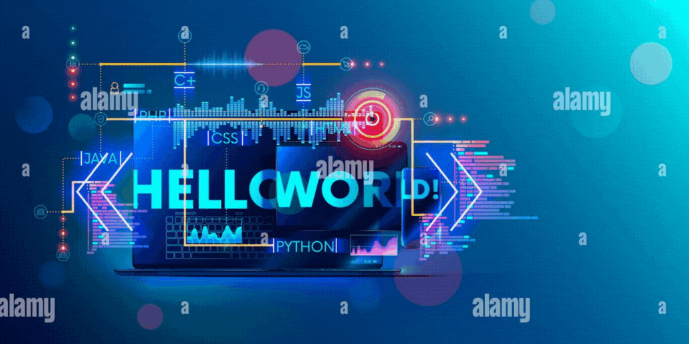

<h3 align="left">Highlights</h3>

- 👨 I am disciplined and self reliant programmer from Uzbekistan.
- ✍ I am currently learning software development at Microverse.
- 🦾 I’m currently expert at `JavaScript|React|React Native|Redux|Python|Ruby|RoR`
- 🌍 I am collaborating currently with other devs around the world.
- 🏢 I am open to new opportunities.
- 🙄 I am a creative thinker and goal getter.
- 🛰 You can reach me at: juraboevhaliljon@gmail.com

<h2 > Languages and Tools 🔥  </h2>

  
 
  
  
    

  
  

  
 

<h2 > Connect with me  💻</h2>

  
  

 More stats about me

